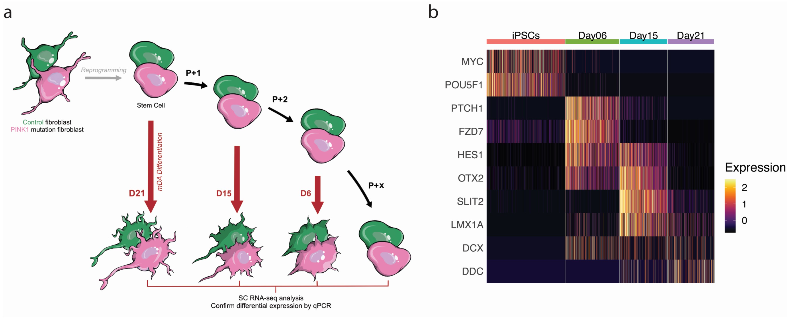
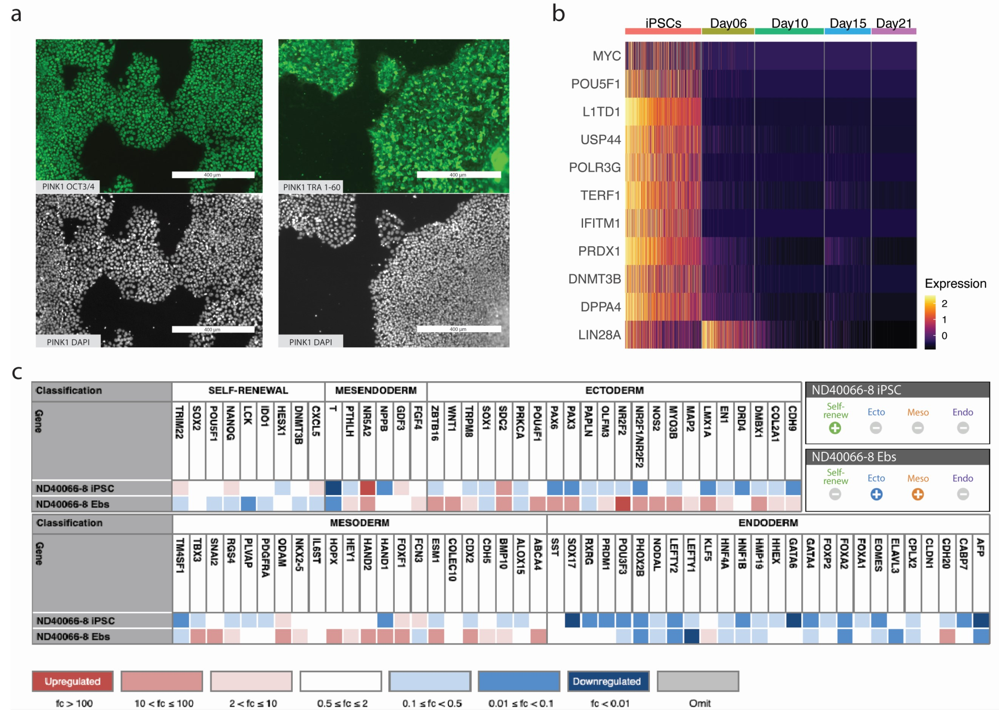
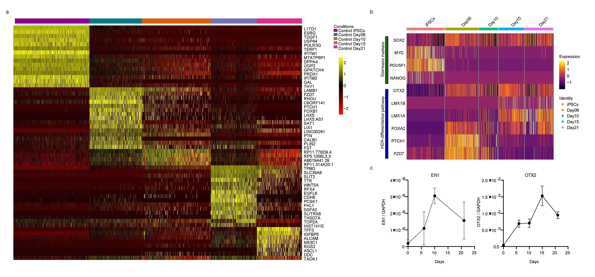
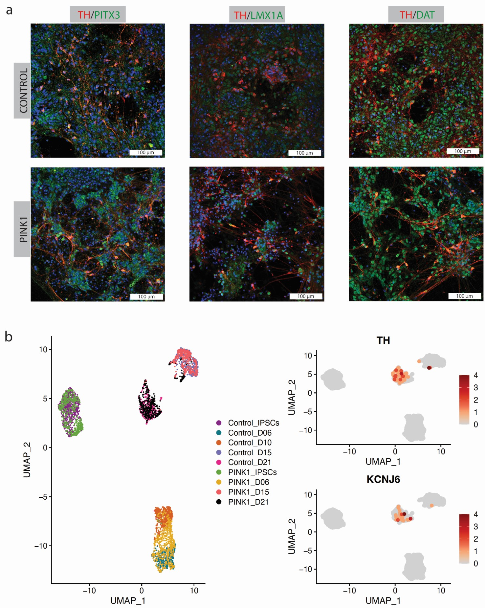
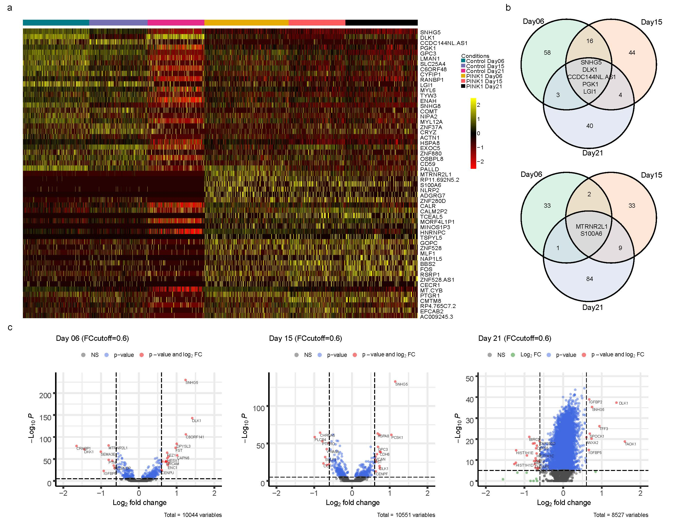
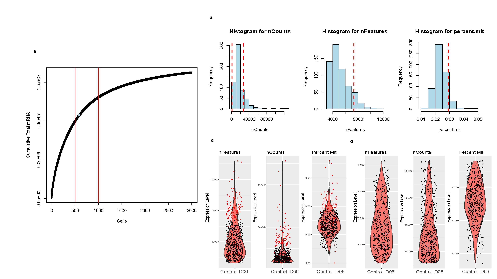

# PINK1 shows LRRK2, Parkin, and SNCA as part of the Parkinson’s network.


# Abstract

Parkinson’s disease (PD) is the second most prevalent neurodegenerative disorder, yet there is no treatment that can prevent or slow its progression. The mechanisms leading to PD pathology are not well understood, but we can gain insight by studying mutations known to cause PD. We used iPSCs carrying a homozygous mutation (ILE368ASN) within the PINK1 (PARK6) gene to generate midbrain dopaminergic (mDA) neurons, the primary targets of PD. Pairwise comparison between three independent pairs of a PINK1 and a control cell line, using single cell RNA sequencing, identified 151 genes consistently dysregulated at three different timepoints of dopaminergic differentiation. Upon examination, many of these genes formed a network which not only includes genes directly interacting with PINK1-related pathways like Parkin, but also genes that link to several additional PD-related pathways, including LRRK2, DJ-1 and α-synuclein. This suggests that pathology resulting from other PD mutations converges on a common PD network.

<!--  -->


**Figure 1:** Experimental design.


**Figure 2:** Generation and classification of iPS cell lines.
**a)**. Immunocytochemistry. Staining for the iPSC markers Oct3/4 and TRA-180. DAPI was used to stain cell nuclei as a reference. 
**b)**. Results of Scorecard analysis of iPSCs and embryonic bodies (EBs). 
iPSCs are expected to show high expression of self-renewal genes (Self-renew +) and low mesoderm, ectoderm and endoderm marker expression (Ecto -, Meso -, Endo -).
EBs are cells at an early stage of spontaneous differentiation. Scorecard analysis of EBs determines the iPSC cell line’s potential to differentiate into the three germ layers: ectoderm, mesoderm, and endoderm. EBs are expected to express few or no self-renewal genes (Self-renew -) and to show expression of some mesoderm, ectoderm and endoderm markers: Ecto +/-, Meso +/-, Endo +/-.



**Figure 3:** iPSC status, differentiation and classification of mDA neurons.
**a)**. Heatmap of the top 15 differential expressed genes per time-point (adjusted p-value<0.01 and fold change >0.1) across the different time points of the control data that examined (IPSCs,Day06, Day15 and Day21).  **b)**. Expression of stemness markers: SOX2, MYC (c-Myc), POU5F1 (Oct4), and NANOG, and mDA-specific differentiation pathways in differentiating neurons (SC and qPCR): Otx2, EN1, Lmx1b, Lmx1a, and Foxa2. SOX2 directs the differentiation of iPSCs into neural progenitors and for maintains the properties of neural progenitor stem cells.



**Figure 4:** iPSC status, differentiation and classification of mDA neurons. **a)**. Expression of mDA-specific differentiation pathways in differentiating neurons (SC and qPCR): Otx2, EN1, Lmx1b, Lmx1a, and Foxa2 (also see Table 2). **b)**. Staining for DA marker TH, neuronal marker MAP2.



**Figure 5:** **a)** Heatmap of the common differential expressed genes (adjusted p-value<0.01 and fold change >0.1) across the different time points that examined (Day06, Day15 and Day21). Each column is a single cell, and each row is a single gene. The bar on the top shows the experimental origin of cells. **b)** Venn diagrams of the differential expressed genes across time points. **c)** Volcano plot for the pairwise differential expression analysis. For illustration purposes we used 0.6 fold change as threshold to annotate the genes with greater fold change and significant adjusted p-value (adjusted p-value<0.01).


# scRNAseq Analysis

## Libraries 
<details>
    <summary>Code</summary>
    ```{r libraries, include=FALSE}
    library(reticulate)
    use_python("C:/Users/dimitrios.kyriakis/AppData/Local/Continuum/anaconda3/envs/iscwrapper/python.exe", required = TRUE)
    options(future.globals.maxSize= 2122317824)
    library(sctransform)
    library(Seurat)
    ibrary( RColorBrewer)
    library(tictoc)
    library(crayon)
    library(stringr)
    library(Routliers)
    library(jcolors)
    library(cluster)
    library(garnett)
    library(NMF)
    library(ggplot2)
    library(ggpubr)
    library(cowplot)
    set.seed(123)
    ```
</details>


## Setting Up
<details>
    <summary>Code</summary>  
    ```{r setup}
    # ================================ SETTING UP ======================================== #
    tool="seurat"
    project ="Michi_Data"
    dataset <- project
    Data_select <- ICSWrapper::data_selection(project)
    WORKDIR <- Data_select$WORKDIR
    list_of_files <- Data_select$list_of_files
    condition_names <- Data_select$condition_names
    condition_names <- condition_names[c(1,2,3,4,5,6,8,28,29)]
    list_of_files <- list_of_files[c(1,2,3,4,5,6,8,28,29)]
    organism<- Data_select$organism
    file<- Data_select$file
    data_10x<- Data_select$data_10x
    setwd(Data_select$WORKDIR)
    color_cond <- c( "magenta4", "#007A87",brewer.pal(6,"Dark2")[-1],"#FF5A5F","black")
    color_clust <- c(brewer.pal(12,"Paired")[-11],"black","gray","magenta4","seagreen4",brewer.pal(9,"Set1")[-6],brewer.pal(8,"Dark2"))
    color_cells <- c(brewer.pal(9,"Set1")[-6],"goldenrod4","darkblue","seagreen4")
    color_list <- list(condition=color_cond,Cluster=color_clust,Cell_Type=color_cells,State=color_clust)
    # ========= Parameters
    imputation = FALSE
    remove_mt=FALSE
    remove_ribsomal=FALSE
    n_cores=4
    elbow = TRUE
    SCT=TRUE
    criteria_pass=3
    min.cells <- 10
    min.features <- 200
    ```
</details>


## Preprocessing

The identification of the low quality cells was done separately in each data set. In order to select only the highest quality data, we sorted the cells by the cumulative gene expression. A subset of cells with the highest cumulative expression was considered for the analysis [1]. 
Additional to this filtering, we defined cells as low-quality, based on three criteria for each cell. The number of the genes that expressed is more than 200 and 2 median-absolute- deviations (MADs) above the median, the total number of counts is 2 MADs above or below the median and the percentage of counts to mitochondrial genes is 1.5 median-absolute- deviations (MADs) above the median. Cells failing at least one criteria were considered as low quality cells and filtered out from further analysis. Similar to the cell filtering, we filtered out the low quality genes that been expressed in less than 10 cells in the data. 


<details>
    <summary>Code</summary>  
    ```{r readfiles}
    # ======== Perform an integrated analysis ====
    NewDir <- paste0(Sys.Date(),"_",tool,"_elbow_",elbow,"_Mito-",remove_mt,"_Ribo-",remove_ribsomal,"_SCT-",SCT,"_criteria_pass-",criteria_pass)
    dir.create(NewDir)
    setwd(NewDir)
    dir.create("QC")
    setwd("QC")
    Return_fun <- ICSWrapper::create_cds2(list_of_files=list_of_files,
                                        condition_names=condition_names,
                                        min.features =min.features,min.cells=min.cells,
                                        remove_mt=remove_mt,data_10x=data_10x,
                                        elbow = elbow,tool=tool,n_cores=1,SCT=SCT,
                                        criteria_pass = criteria_pass,vars.to.regress=c("nCount_RNA"))
    Combined  <- Return_fun$Combined
    Data_List <- Return_fun$Data_List
    setwd("../")
    ```
</details>



**Supl.Figure1:** Quality control Plots of control sample Day 06. a) Cumulative Total number of counts. The red vertical lines represent the down and upper bound of the expected elbow. The blue dot represent the transitional point calculated using ecp r package. b)  Histograms of the three criteria that used for low quality cell filtering. c,d) Violin plots of the three criteria. c) Cell score before filtering. Red dots are the cells that filtered after the quality control. d) The overview of the three criteria after filtering step.  


## Data Intergration

The integration of the filtered matrices of the different datasets was performed using scTransform [2] on a Seurat object [3] based on the treatment. The final gene expression matrix which used for the downstream analysis, consist of 4495 cells and 39194 genes. Principal component analysis (PCA) was computed using the 5000 most variable genes on the integrated data. 


<details>
    <summary>Code</summary> 
    ```{r remapping}
    dir.create("Aligned_Cond_RegPhase")
    setwd("Aligned_Cond_RegPhase")
    # ================================== ALLIGN CONDITIONS =========================================
    DefaultAssay(Combined) <- "RNA"
    Combined$condition <- factor(as.factor(Combined$condition), levels = c("Control_IPSCs", "Control_D06"  ,"Control_D10",   "Control_D15",   "Control_D21",
    "PINK1_IPSCs","PINK1_D06",     "PINK1_D15",     "PINK1_D21"))
    Combined$Treatment <-as.vector(Combined$condition)
    Combined$Treatment[grep("Control",Combined$Treatment)] <- "Control"
    Combined$Treatment[grep("PINK",Combined$Treatment)] <- "PINK"
    pink.list <-SplitObject(Combined,split.by = "Treatment")
    for (i in 1:length(pink.list)) {
        pink.list[[i]] <- SCTransform(pink.list[[i]], verbose = FALSE,vars.to.regress=c("G2M.Score","S.Score"))
    }
    # doi: https://doi.org/10.1101/576827
    int.features <- SelectIntegrationFeatures(object.list = pink.list, nfeatures = 3000)
    pink.list <- PrepSCTIntegration(object.list = pink.list, anchor.features = int.features,
                                        verbose = FALSE)
    int.anchors <- FindIntegrationAnchors(object.list = pink.list, normalization.method = "SCT",
                                                anchor.features = int.features, verbose = FALSE)
    Seurat.combined <- IntegrateData(anchorset = int.anchors, normalization.method = "SCT",
                                        verbose = FALSE)
    DefaultAssay(object = Seurat.combined) <- "integrated"
    Combined <- Seurat.combined
    setwd("../")
    ```
</details>


## Clustering

The clustering of data was performed using Louvain clustering. The resolution of the clustering was selected based on the best silhouette score of the different resolutions [4].


<details>
    <summary>Code</summary> 
    ```{r Clustering}
    # ================================== Clustering =========================================
    dir.create("Clusters")
    setwd("Clusters")
    Combined <- ICSWrapper::reduce_dim(Combined,project=project,assay = "SCT")$Combined#,resolution=c(0.1))$Combined
    # ====== Reorder Conditions
    Combined$condition <- factor(as.factor(Combined$condition), levels = c("Control_IPSCs", "Control_D06"  ,"Control_D10",   "Control_D15",   "Control_D21",
    "PINK1_IPSCs","PINK1_D06",     "PINK1_D15",     "PINK1_D21"))
    # ====== PLot
    pdf(paste(Sys.Date(),project,"tsne","projection.pdf",sep="_"))
    ICSWrapper::plot_cells(Combined,target="condition",leg_pos="right",save=FALSE,ncol=1,color_list = color_list)
    ICSWrapper::plot_cells(Combined,target="Cluster",leg_pos="right",save=FALSE,ncol=1,color_list = color_list)
    dev.off()
    # Quality Plots
    ICSWrapper::plot_nFeatures(Combined,title="",save=TRUE,tiff=FALSE,reduce="t-SNE",p3D=FALSE)
    ICSWrapper::plot_tot_mRNA(Combined,title="",save=TRUE,tiff=FALSE,reduce="t-SNE",p3D=FALSE)
    if(tolower(tool)=="seurat" & elbow){
        p3 <- DimPlot(object = Combined, reduction = "umap", group.by = "condition",cols = color_cond)
        p4 <- DimPlot(object = Combined, reduction = "umap", label = TRUE,cols = color_clust)
        pdf(paste(Sys.Date(),project,"umap","Seurat.pdf",sep="_"))
        print(p3)
        print(p4)
        dev.off()
    }
    setwd("../")
    saveRDS(Combined,paste0("Clustered_",NewDir,".rds"))
    # Sum up Plots
    pdf(paste(Sys.Date(),project,"_projection_Aligned_Treatment.pdf",sep="_"))
    ICSWrapper::plot_cells(Combined,target="condition",leg_pos="right",save=FALSE,ncol=1,reduction="umap",color_list = color_list)
    ICSWrapper::plot_cells(Combined,target="Cluster",leg_pos="right",save=FALSE,ncol=1,reduction="umap",color_list = color_list)
    ICSWrapper::plot_cells(Combined,target="Phase",leg_pos="right",save=FALSE,ncol=1,reduction="umap",color_list = color_list)
    ICSWrapper::plot_cells(Combined,target="condition",leg_pos="right",save=FALSE,ncol=1,reduction="tsne",color_list = color_list)
    ICSWrapper::plot_cells(Combined,target="Cluster",leg_pos="right",save=FALSE,ncol=1,reduction="tsne",color_list = color_list)
    ICSWrapper::plot_cells(Combined,target="Phase",leg_pos="right",save=FALSE,ncol=1,reduction="tsne",color_list = color_list)
    dev.off()
    # ---------------------------------------------------------------------------------------
    res<-ICSWrapper::scatter_gene(Combined,features = c("nCount_RNA","nFeature_RNA","percent.mito","percent.rb"),size=0.9)
    pdf("Combined_QC.pdf")
    print(res)
    # Free Space
    dev.off()
    Return_fun <- NULL
    Seurat.combined <- NULL
    pink.list <- NULL
    #save.image("IPSCs_PINK.RData")
    ```
</details>


## iPSCs Differentiation

A short list of manually curated markers was used in order to validate the different stages of the differentiation process. 

<details>
  <summary>Code</summary> 
    ```{r  Developmental_Markers}
    # ================================== Developmental Stages =========================================
    dir.create("Developmental_Markers")
    setwd("Developmental_Markers")
    DefaultAssay(Combined) <- "RNA"
    file <- paste0(WORKDIR,"/Gene_Lists/Paper_IPCS_genes.txt")
    genes_state <-read.table(file)
    pdf("Cell_Assignment_Plots.pdf")
    res <- cell_type_assignment(object=Combined,tab_name = "Identity",group_by="Cluster",file,assign=TRUE,color_list = color_clust)
    Combined$Identity <- as.vector(Combined$Cluster)
    for (level in levels(Combined$Cluster)){
        Combined$Identity[as.vector(Combined$Cluster) == as.numeric(level)] <- res$radar$Identity[as.numeric(level)]
    }
    Combined$Identity <- as.factor(Combined$Identity)
    DimPlot(Combined,group.by = c("Identity","Cluster"))
    dev.off()
    for(category in levels(as.factor(genes_state$V1))){
        category_genes <- toupper(as.vector(genes_state[genes_state$V1==category,2]))
        category_genes_l <- category_genes[category_genes%in%rownames(Combined)]
        Combined <- AddModuleScore(Combined,features = list(category_genes_l),name = category)
        pdf(paste0(category,"_umap_projection_condition_regPhase.pdf"),width = 8,height = 8)
        res <- ICSWrapper::scatter_gene(Combined,features = category_genes_l,ncol = 2,nrow = 2,size=1.1)
        plot(res)
        dev.off()
    }
    features <- c("iPSC_identity1","Mda_identity_stage11", "Mda_identity_stage21","Mda_identity_stage31","Mda_identity_stage41", "Non.Mda1")    
    pdf("Development_umap_projection_condition_regPhase.pdf",width = 12,height = 8)
    res <- ICSWrapper::scatter_gene(Combined,features = features,ncol = 3,nrow = 2,size=1.1)
    print(ggarrange(plotlist=res,ncol = 3,nrow = 2))
    dev.off()
    Combined <- ScaleData(Combined,rownames(Combined))
    category_genes <- toupper(as.vector(genes_state[,2]))
    category_genes_l <- category_genes[category_genes%in%rownames(Combined)]
    ICSWrapper::annotated_heat(Combined,row_annotation = c(1),gene_list = category_genes_l,ordering = "condition",title="Development_Markers",color_list = color_list)
    ics_scanpy(Combined,features = category_genes_l,group.by = "condition",Rowv = NA,scale="c1")
    setwd("../")
    # --------------------------------------------------------------------------------------------------
    ```
</details>
  
## Pairwise Differential Expression


<details>
  <summary>Code</summary> 
    ```{r Pairwise DF}
    # =============================== PAIRWISE DF ===============================================
    dir.create("DF_Pairwise_PAPER")
    setwd("DF_Pairwise_PAPER")
    library(EnhancedVolcano)
    Combined$condition <- as.factor(Combined$condition)
    Idents(Combined) <- as.factor(Combined$condition)
    cl_combinations <- combn(levels(Combined$condition),2)
    cl_combinations <- cl_combinations[,c(5,13,25,30)]
    DefaultAssay(Combined) <- "RNA"
    Combined <- NormalizeData(Combined)
    Combined <- ScaleData(Combined,rownames(Combined@assays$RNA@counts))
    library(parallel)
    pairwise_df <- function (comb,object,cl_combinations){
        DefaultAssay(object) <- "RNA"
        title <- paste(cl_combinations[,comb],collapse = "_")
        dir.create(title)
        setwd(title)
        target <- "condition"
        idents <- as.vector(cl_combinations[,comb])
        ident.1 <- idents[1]
        print(ident.1)
        ident.2 <- idents[2]
        pbmc.markers <- FindMarkers(object = object,
                                        ident.1 = ident.1,
                                        ident.2 =ident.2,
                                    assay ="RNA",min.pct =0.1,
                                    logfc.threshold=0.0,
                                    only.pos = FALSE,
                                    test.use = "MAST",latent.vars = c("nCount_RNA"))
        pbmc.markers$gene <- rownames(pbmc.markers)
        qvalue <- p.adjust(pbmc.markers$p_val, method = "BH",n=dim(object@assays$RNA@counts)[1])
        pbmc.markers$qvalue <- qvalue
        top <- pbmc.markers[pbmc.markers$p_val_adj<0.05,]
        to_fc <- top[order(abs(top$avg_logFC),decreasing = TRUE),]
        to_fc_gene <- rownames(to_fc)[1:50]
        #top10 <- top %>% top_n(n = 50, wt = abs(avg_logFC))
        #top10_genes<- rownames(top10)
        temp <- object[,object$condition%in%c(ident.1,ident.2)]
        temp$condition <- as.factor(as.vector(temp$condition))
        # debugonce(annotated_heat)
        pdf("Volcano.pdf")
        plot(EnhancedVolcano(pbmc.markers,
                        lab = pbmc.markers$gene,
                        x = 'avg_logFC',
                        y = 'p_val_adj',subtitle = paste(ident.1,"vs",ident.2,"(FCcutoff=0.6)"),
                        xlim = c(-2, 2),FCcutoff = 0.6))
        dev.off()
        ICSWrapper::annotated_heat(object=temp,
                    row_annotation=c(1),
                    gene_list=to_fc_gene,
                    Rowv=TRUE,
                    gene_list_name="DF_genes",
                    title=title,
                    ordering="condition",One_annot = TRUE)
        DefaultAssay(temp) <- "integrated"
        write.table(pbmc.markers, file = paste0(Sys.Date(),"_TO_EXP_each_",target,"_",title,".tsv"),row.names=FALSE, na="", sep="\t")
        setwd("../")
    }
    # Apply DF
    mclapply(c(1:dim(cl_combinations)[2]),FUN=pairwise_df,object=Combined,cl_combinations=cl_combinations,mc.cores=1)
</details>


## Intersection of DF genes

<details>
  <summary>Code</summary> 
    ```{r gene intersection}
    dirs_pairs <- list.dirs("C:/Users/dimitrios.kyriakis/Desktop/PhD/Projects/Michi_Data/DF_Pairwise_Networks/DF_Pairwise_PAPER",full.names = TRUE )[-1]
    dirs_pairs <- grep('IPSC|D06.*D06|D15.*D15|D21.*D21',dirs_pairs,value = TRUE)
    dirs_pairs <- dirs_pairs[-4]
    df_return_nt_cntrl <- list()
    df_return_nt_pink <- list()
    df_return_nt_all <- list()
    # ===== Iterate through different DF files
    for (iter in 1:length(dirs_pairs)){
        dirs_iter <- dirs_pairs[iter]
        file <- paste0(dirs_iter ,"/", dir(dirs_iter, "*.tsv"))
        l1 <- read.table(file,header=TRUE)
        l1$cluster <- l1$avg_logFC
        l1$cluster[ l1$avg_logFC<0] <- "PINK"
        l1$cluster[ l1$avg_logFC>0] <- "Control"
        ctrl_l1 <- l1[grep("Control",l1$cluster),]
        pink_l1 <- l1[grep("PINK",l1$cluster),]
        all_l1 <-  l1
        df_return_nt_cntrl[[iter]] <- as.vector(ctrl_l1[ctrl_l1$p_val_adj<0.01 & abs(ctrl_l1$avg_logFC) >0.4,"gene"])
        df_return_nt_pink[[iter]] <- as.vector(pink_l1[pink_l1$p_val_adj<0.01 & abs(pink_l1$avg_logFC) >0.4,"gene"])
        print(length(df_return_nt_cntrl[[iter]]))
        print(length(df_return_nt_pink[[iter]]))
        df_return_nt_all[[iter]] <- c(df_return_nt_cntrl[[iter]] ,df_return_nt_pink[[iter]])
    }
    # # ============= Intersect Common Genes
    cntrl_intesect <- Reduce(intersect, df_return_nt_cntrl)
    print(cntrl_intesect)
    pink_intesect <- Reduce(intersect, df_return_nt_pink)
    print(pink_intesect)
    length(cntrl_intesect)
    length(pink_intesect)
    # ==== PLOT VENN
    pdf("Control_venn_diagramm.pdf")
    day06 <- c(df_return_nt_cntrl[[1]])
    day15 <- c(df_return_nt_cntrl[[2]])
    day21 <- c(df_return_nt_cntrl[[3]])
    # Generate plot
    v <- venn.diagram(list(Day06=day06, Day15=day15,Day21=day21),
                    fill = myCol,
                    alpha = c(0.5, 0.5, 0.5), cat.cex = 1.5, cex=1.5,
                    filename=NULL)
    # have a look at the default plot
    grid.newpage()
    grid.draw(v)
    # have a look at the names in the plot object v
    lapply(v,  names)
    # We are interested in the labels
    lapply(v, function(i) i$label)
    v[[11]]$label <- paste(intersect(intersect(day06, day15),day21), collapse="\n")  
    # plot  
    grid.newpage()
    grid.draw(v)
    dev.off()
    # ======= PINK VENN
    pdf("PINK_venn_diagramm.pdf")
    day06 <- c(df_return_nt_pink[[1]])
    day15 <- c(df_return_nt_pink[[2]])
    day21 <- c(df_return_nt_pink[[3]])
    # Generate plot
    v <- venn.diagram(list(Day06=day06, Day15=day15,Day21=day21),
                    fill = myCol,
                    alpha = c(0.5, 0.5, 0.5), cat.cex = 1.5, cex=1.5,
                    filename=NULL)
    # have a look at the default plot
    grid.newpage()
    grid.draw(v)
    # have a look at the names in the plot object v
    lapply(v,  names)
    # We are interested in the labels
    lapply(v, function(i) i$label)
    v[[11]]$label <- paste(intersect(intersect(day06, day15),day21), collapse="\n")  
    # plot  
    grid.newpage()
    grid.draw(v)
    dev.off()
    setwd("../")
    # ----------------------------------------------------------------------------------------------
    ```
</details>
