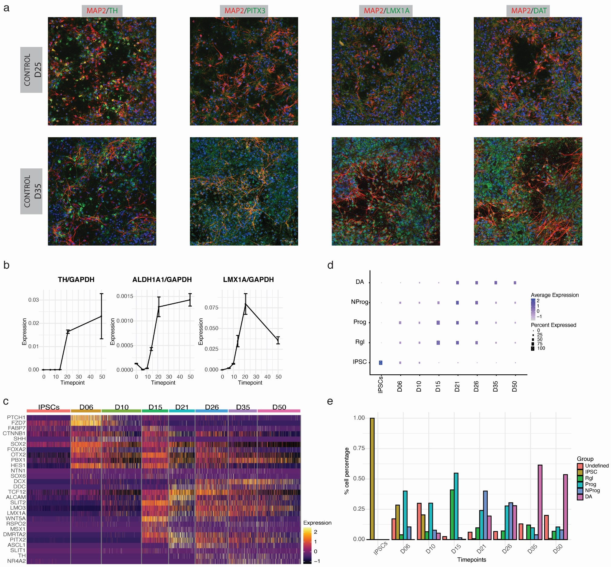
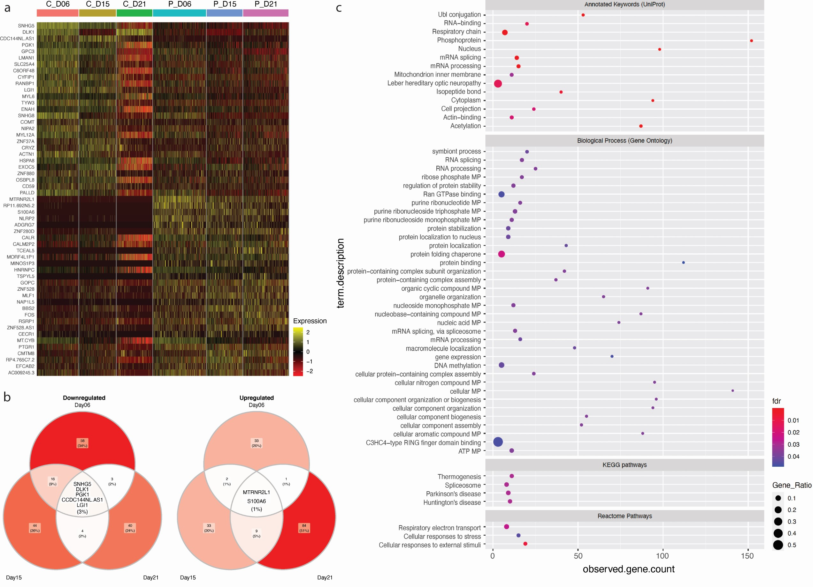
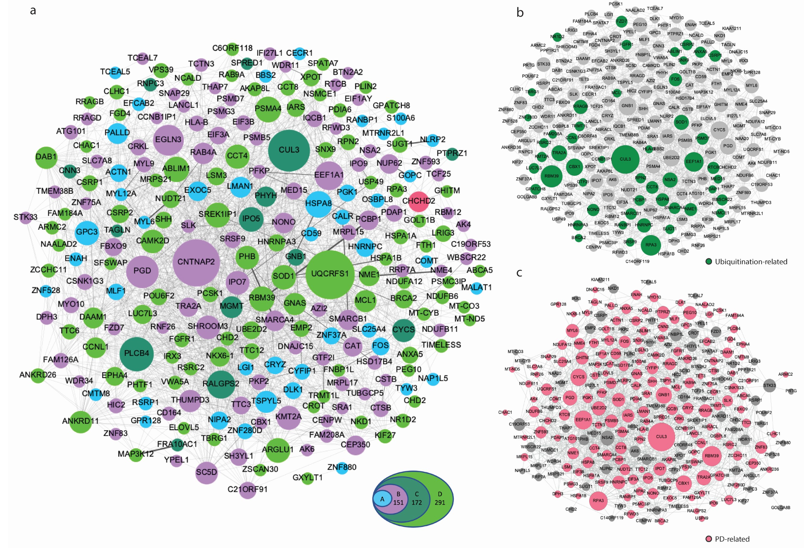

# PINK1 shows LRRK2, Parkin, and SNCA as part of the Parkinson’s network.

# Authors
Gabriela Novak, Dimitrios Kyriakis, Kamil Grzyb, Michela Bernini, Alexander Skupin

# Google Docs
https://drive.google.com/drive/folders/1xoEtZF-J95cBWNCMLy2bk0pyJo4HLyX_?usp=sharing
# Basecamp
https://3.basecamp.com/3652073/buckets/15964731/vaults/2493637291

# Abstract

Parkinson’s disease (PD) is the second most prevalent neurodegenerative disorder, yet there is no treatment that can prevent or slow its progression. The mechanisms leading to PD pathology are not well understood, but we can gain insight by studying mutations known to cause PD. We used iPSCs carrying a homozygous mutation (ILE368ASN) within the PINK1 (PARK6) gene to generate midbrain dopaminergic (mDA) neurons, the primary targets of PD. Pairwise comparison between three independent pairs of a PINK1 and a control cell line, using single cell RNA sequencing, identified 151 genes consistently dysregulated at three different timepoints of dopaminergic differentiation. Upon examination, many of these genes formed a network which not only includes genes directly interacting with PINK1-related pathways like Parkin, but also genes that link to several additional PD-related pathways, including LRRK2, DJ-1 and α-synuclein. This suggests that pathology resulting from other PD mutations converges on a common PD network.

<!--  -->
<!--  -->

**Figure 1:
Experimental design. a.**  Fibroblasts were used to generate human induced
pluripotent stem cells (iPSCs), which were then used to generate mDA neurons.
Differentiation was initiated concurrently in a PINK1 and a control cell line, at three different
times to obtain cells at different stages of differentiation that could all be collected for SCRNAseq at the same time, thus avoiding batch effects. “P+1” indicates that the iPSCs were
passaged before new differentiation was initiated. Since D10 was not used in pairwise
analysis, we indicated “P+2” between D15 and D6 differentiation initiation. B. Heatmap
illustrating the transitions in gene expression from iPSC markers (MYC, POU5F1-OCT3/4), to
genes associated with mDA differentiation (PTCH1, FZDZ, HES1, OTX2, SLIT1, LMX1A), and
finally to early expression of mature mDA markers (DCX, DDC). This is discussed in more
detail in the text and in Fig. 3 & 4. The gene expression matrix used here consists of 4495
cells (see Methods section). 


**Figure 2: Classification of iPSC status. a.** Immunocytochemistry (ICC). Staining for the iPSC markers OCT3/4 and TRA-1-80 of iPSC colonies, prior to differentiation. DAPI was used to
stain cell nuclei as a reference. **b.** Expression of genes known to indicate iPSC status (MYC, POU5F1-OCT3/4) and of genes identified by a differential expression analysis between iPSCs and differentiating cells (also see Supplement Fig. 12). TDGF-1 is expressed in iPS cells of high stemness60; L1TD1, USP44, POLR3G, and TERF1 are essential for the maintenance of pluripotency in human stem cells 61–64; IFITM1, DPPA4, and PRDX1 are associated with
stemness 65–67. c. Results of Scorecard analysis of iPSCs and embryonic bodies (EBs). iPSCs
are expected to show high expression of self-renewal genes and low expression of
mesoderm, ectoderm and endoderm markers. EBs are cells at an early stage of spontaneous
differentiation. Scorecard analysis of EBs determines the iPSC line’s potential to
differentiate into the three germ layers, hence, EBs are expected to express few or no selfrenewal genes and to show expression of some mesoderm, ectoderm and endoderm
markers: Ecto +/-, Meso +/-, Endo +/-.



**Figure 3.  In vitro differentiation of iPSC-derived mDA neurons recapitulates the in vivo
process. a.** To illustrate the maturation of neuronal morphology and mDA status,
differentiated neurons were stained at D25 and D35 for a neuronal marker MAP2 (red) and
mDA markers (green): TH, PITX3, LMX1A and DAT. **b.** Quantitation of mDA markers TH,
ALDH1A1 and LMX1A. using absolute quantitation via qPCR and standardization to a
housekeeping gene. Each timepoint represents three biological replicates, amplified in
duplicate. Standard error (SE) bars are the SE of biological replicates. The expression levels are standardized to total RNA and to the expression of the housekeeping gene GAPDH.
c. Heatmap showing the expression of genes known from literature to be involved and
necessary for mDA neuron differentiation (Supplement Table 3a,b). **d.** The mDA
differentiation gene expression profile recently published by Ásgrímsdóttir and Arenas
(2020)68 was used to show the progression during differentiation, from iPSCs, to radial glia
(Rgl), to progenitors (Prog) and neuroprogenitors (NProg), to early mDA neurons (DA) For
genes used to determine expression modules see Supplement Table 3b). 


**Figure 4: Classification of mDA status. a.** TH positive neurons co-express mDA markers
PITX3, LMX1A and DAT in control (top) and PINK1 cell line (bottom), at D35. **b.** Table on the left shows that, based on our SC-RNAseq data, cell lines cluster according to differentiation stage, indicating that gene expression is very homogenous in the control and the PINK1 cell lines, which allows for the detection of even subtle alteration by the presence of the PINK1 mutation. Tables on the right show trajectory of expression of TH and KCNJ6 (GIRK2), two mDA markers. At D21 neurons begin to show TH expression, together with expression of mDA markers, this indicates that they are becoming early postmitotic mDA neurons. Similar observations can also be made from an expression heatmap shown in Supplement Figure
12. 



**Figure 5: Differentialy expressed genes (DEGs)**  in a cell line homozygous for a mutation in the PINK1 gene, compared to a control cell line, at three timepoints during the
differentiation of mDA neurons (D6, D15 and D21). **a.** Heatmap of the top DEGs. Each
column corresponds to a timepoint for either control (left 3) or PINK1 cells (right 3); each
row shows the expression of one gene in individual cells. **b.** Top DEGs. The minimum fold
change was increased to highlight the top differentially expressed genes. We identified top
56 genes as our group A (Table 2), here we show the top five upregulated genes (left Venn
diagram) and the top three downregulated genes (right Venn diagram). **c.** Enrichment
analysis performed using the STRING69 database. The top KEGG pathway associated with
this dataset is Parkinson’s disease. Other three KEGG pathways identified were Spliceosome,
Huntington's disease and Thermogenesis, in order of decreasing significance. Details are
listed in Supplement Table 12.



**Figure 6. Network analysis. a.** Protein-protein interaction network based on known interactions available through the STRING69 and GeneMANIA70 databases. Only strong interactions were retained, predicted interactions or text associations were omitted (see Methods). Betweenness centrality was used to illustrate the relative importance of each node within the network through the level of its connectedness to other proteins. In the larger the circle, the more partners the node is connected to. The colours represent the DEG sets, with the top 56 DEGs (group A) in light blue, group B in purple, group C in dark green and group D in light green. CHCHD2 (pink, part of group B) is a DEG which has recently also been identified as a PARK gene. **b.** DEGs which play a role in ubiquitination Additional functional pathways are listed in Supplement Fig. 7 and Supplement Table 9. Specific connection to ubiquitination are shown in Supplement Fig.8. **c.** Based on literature, 68% of the DEGs of this network are already known to be associated with PD (for references see Supplement Table 10). Supplement Fig.9 shows which genes/proteins of the network directly interact with PARK genes through known protein-protein interactions. The topology of all three networks is the same, the different appearance is a result of a separate analysis run, but the connections and size of the nodes remain the same.


**Figure 7. Comparative proteomics analysis between CTRL and Pink1 cell line at D25 and
D40 validates the manifestation of the transcriptional phenotype.** Results of proteomic
analysis at D25 and D40 of the differentiation protocol. **a.** Protein levels of protein that were detected as both top differentially abundant at the protein level by the proteomics analysis, and by SC-RNAseq, as differentially expressed at the mRNA level. The data shows results at two timepoints, D25 and D40, in two biological replicates per timepoint. **b.** This figure shows a network of proteins differentially expressed between a control and a PINK1 mutationcarrying cell line, at D25 and D40. Proteins which are differentially expressed at both D25 and D40 are highlighted in green and point to a dysfunction of the dopaminergic system. D25 differentially abundant proteins are in purple, D40 in blue, proteins also identified as by SC-RNAseq differentially expressed at the mRNA level are in pink. For a table of proteins see
Supplement Table 13.


# scRNAseq Analysis

## Libraries 
<details><summary>Code</summary> 
<p>

```r
library(reticulate)
use_python("C:/Users/dimitrios.kyriakis/AppData/Local/Continuum/anaconda3/envs/iscwrapper/python.exe", required = TRUE)
options(future.globals.maxSize= 2122317824)
library(sctransform)
library(Seurat)
ibrary( RColorBrewer)
library(tictoc)
library(crayon)
library(stringr)
library(Routliers)
library(jcolors)
library(cluster)
library(garnett)
library(NMF)
library(ggplot2)
library(ggpubr)
library(cowplot)
library(RColorBrewer)
set.seed(123)
```
</p>
</details>


## Setting Up
<details><summary>Code</summary> 
<p>

```r
tool="seurat"
project ="Michi_Data"
dataset <- project
Data_select <- ICSWrapper::data_selection(project)
WORKDIR <- Data_select$WORKDIR
list_of_files <- Data_select$list_of_files
condition_names <- Data_select$condition_names
condition_names <- condition_names[c(1,2,3,4,5,6,8,28,29)]
list_of_files <- list_of_files[c(1,2,3,4,5,6,8,28,29)]
organism<- Data_select$organism
file<- Data_select$file
data_10x<- Data_select$data_10x
setwd(Data_select$WORKDIR)
color_cond <- c( "magenta4", "#007A87",brewer.pal(6,"Dark2")[-1],"#FF5A5F","black")
color_clust <- c(brewer.pal(12,"Paired")[-11],"black","gray","magenta4","seagreen4",brewer.pal(9,"Set1")[-6],brewer.pal(8,"Dark2"))
color_cells <- c(brewer.pal(9,"Set1")[-6],"goldenrod4","darkblue","seagreen4")
color_list <- list(condition=color_cond,Cluster=color_clust,Cell_Type=color_cells,State=color_clust)
imputation = FALSE
remove_mt=FALSE
remove_ribsomal=FALSE
n_cores=4
elbow = TRUE
SCT=TRUE
criteria_pass=3
min.cells <- 10
min.features <- 200
```
</p>
</details>


## Preprocessing

The identification of the low quality cells was done separately in each data set. In order to select only the highest quality data, we sorted the cells by the cumulative gene expression. A subset of cells with the highest cumulative expression was considered for the analysis [1]. 
Additional to this filtering, we defined cells as low-quality, based on three criteria for each cell. The number of the genes that expressed is more than 200 and 2 median-absolute- deviations (MADs) above the median, the total number of counts is 2 MADs above or below the median and the percentage of counts to mitochondrial genes is 1.5 median-absolute- deviations (MADs) above the median. Cells failing at least one criteria were considered as low quality cells and filtered out from further analysis. Similar to the cell filtering, we filtered out the low quality genes that been expressed in less than 10 cells in the data. 


<details><summary>Code</summary> 
<p>

```r
NewDir <- paste0(Sys.Date(),"_",tool,"_elbow_",elbow,"_Mito-",remove_mt,"_Ribo-",remove_ribsomal,"_SCT-",SCT,"_criteria_pass-",criteria_pass)
dir.create(NewDir)
setwd(NewDir)
dir.create("QC")
setwd("QC")
Return_fun <- ICSWrapper::create_cds2(list_of_files=list_of_files,
                                    condition_names=condition_names,
                                    min.features =min.features,min.cells=min.cells,
                                    remove_mt=remove_mt,data_10x=data_10x,
                                    elbow = elbow,tool=tool,n_cores=1,SCT=SCT,
                                    criteria_pass = criteria_pass,vars.to.regress=c("nCount_RNA"))
Combined  <- Return_fun$Combined
Data_List <- Return_fun$Data_List
setwd("../")
```

</p>
</details>


**Supl.Figure1:** Quality control Plots of control sample Day 06. a) Cumulative Total number of counts. The red vertical lines represent the down and upper bound of the expected elbow. The blue dot represent the transitional point calculated using ecp r package. b)  Histograms of the three criteria that used for low quality cell filtering. c,d) Violin plots of the three criteria. c) Cell score before filtering. Red dots are the cells that filtered after the quality control. d) The overview of the three criteria after filtering step.  


## Data Intergration

The integration of the filtered matrices of the different datasets was performed using scTransform [2] on a Seurat object [3] based on the treatment. The final gene expression matrix which used for the downstream analysis, consist of 4495 cells and 39194 genes. Principal component analysis (PCA) was computed using the 5000 most variable genes on the integrated data. 


<details><summary>Code</summary> 
<p>

```r
dir.create("Aligned_Cond_RegPhase")
setwd("Aligned_Cond_RegPhase")
DefaultAssay(Combined) <- "RNA"
Combined$condition <- factor(as.factor(Combined$condition), levels = c("Control_IPSCs", "Control_D06"  ,"Control_D10",   "Control_D15",   "Control_D21",
"PINK1_IPSCs","PINK1_D06",     "PINK1_D15",     "PINK1_D21"))
Combined$Treatment <-as.vector(Combined$condition)
Combined$Treatment[grep("Control",Combined$Treatment)] <- "Control"
Combined$Treatment[grep("PINK",Combined$Treatment)] <- "PINK"
pink.list <-SplitObject(Combined,split.by = "Treatment")
for (i in 1:length(pink.list)) {
    pink.list[[i]] <- SCTransform(pink.list[[i]], verbose = FALSE,vars.to.regress=c("G2M.Score","S.Score"))
}
int.features <- SelectIntegrationFeatures(object.list = pink.list, nfeatures = 3000)
pink.list <- PrepSCTIntegration(object.list = pink.list, anchor.features = int.features,
                                    verbose = FALSE)
int.anchors <- FindIntegrationAnchors(object.list = pink.list, normalization.method = "SCT",
                                            anchor.features = int.features, verbose = FALSE)
Seurat.combined <- IntegrateData(anchorset = int.anchors, normalization.method = "SCT",
                                    verbose = FALSE)
DefaultAssay(object = Seurat.combined) <- "integrated"
Combined <- Seurat.combined
setwd("../")
```

</p>
</details>


## Clustering

The clustering of data was performed using Louvain clustering. The resolution of the clustering was selected based on the best silhouette score of the different resolutions [4].


<details><summary>Code</summary> 
<p>

```r
dir.create("Clusters")
setwd("Clusters")
Combined <- ICSWrapper::reduce_dim(Combined,project=project,assay = "SCT")$Combined#,resolution=c(0.1))$Combined
# ====== Reorder Conditions
Combined$condition <- factor(as.factor(Combined$condition), levels = c("Control_IPSCs", "Control_D06"  ,"Control_D10",   "Control_D15",   "Control_D21",
"PINK1_IPSCs","PINK1_D06",     "PINK1_D15",     "PINK1_D21"))
# ====== PLot
pdf(paste(Sys.Date(),project,"tsne","projection.pdf",sep="_"))
ICSWrapper::plot_cells(Combined,target="condition",leg_pos="right",save=FALSE,ncol=1,color_list = color_list)
ICSWrapper::plot_cells(Combined,target="Cluster",leg_pos="right",save=FALSE,ncol=1,color_list = color_list)
dev.off()
# Quality Plots
ICSWrapper::plot_nFeatures(Combined,title="",save=TRUE,tiff=FALSE,reduce="t-SNE",p3D=FALSE)
ICSWrapper::plot_tot_mRNA(Combined,title="",save=TRUE,tiff=FALSE,reduce="t-SNE",p3D=FALSE)
if(tolower(tool)=="seurat" & elbow){
    p3 <- DimPlot(object = Combined, reduction = "umap", group.by = "condition",cols = color_cond)
    p4 <- DimPlot(object = Combined, reduction = "umap", label = TRUE,cols = color_clust)
    pdf(paste(Sys.Date(),project,"umap","Seurat.pdf",sep="_"))
    print(p3)
    print(p4)
    dev.off()
}
setwd("../")
saveRDS(Combined,paste0("Clustered_",NewDir,".rds"))
# Sum up Plots
pdf(paste(Sys.Date(),project,"_projection_Aligned_Treatment.pdf",sep="_"))
ICSWrapper::plot_cells(Combined,target="condition",leg_pos="right",save=FALSE,ncol=1,reduction="umap",color_list = color_list)
ICSWrapper::plot_cells(Combined,target="Cluster",leg_pos="right",save=FALSE,ncol=1,reduction="umap",color_list = color_list)
ICSWrapper::plot_cells(Combined,target="Phase",leg_pos="right",save=FALSE,ncol=1,reduction="umap",color_list = color_list)
ICSWrapper::plot_cells(Combined,target="condition",leg_pos="right",save=FALSE,ncol=1,reduction="tsne",color_list = color_list)
ICSWrapper::plot_cells(Combined,target="Cluster",leg_pos="right",save=FALSE,ncol=1,reduction="tsne",color_list = color_list)
ICSWrapper::plot_cells(Combined,target="Phase",leg_pos="right",save=FALSE,ncol=1,reduction="tsne",color_list = color_list)
dev.off()
# ---------------------------------------------------------------------------------------
res<-ICSWrapper::scatter_gene(Combined,features = c("nCount_RNA","nFeature_RNA","percent.mito","percent.rb"),size=0.9)
pdf("Combined_QC.pdf")
print(res)
# Free Space
dev.off()
Return_fun <- NULL
Seurat.combined <- NULL
pink.list <- NULL
#save.image("IPSCs_PINK.RData")
```
</p>
</details>


  
## Pairwise Differential Expression

<details><summary>Code</summary> 
<p>

```r
# =============================== PAIRWISE DF ===============================================
dir.create("DF_Pairwise_PAPER")
setwd("DF_Pairwise_PAPER")
library(EnhancedVolcano)
Combined$condition <- as.factor(Combined$condition)
Idents(Combined) <- as.factor(Combined$condition)
cl_combinations <- combn(levels(Combined$condition),2)
cl_combinations <- cl_combinations[,c(5,13,25,30)]
DefaultAssay(Combined) <- "RNA"
Combined <- NormalizeData(Combined)
Combined <- ScaleData(Combined,rownames(Combined@assays$RNA@counts))
library(parallel)
pairwise_df <- function (comb,object,cl_combinations){
    DefaultAssay(object) <- "RNA"
    title <- paste(cl_combinations[,comb],collapse = "_")
    dir.create(title)
    setwd(title)
    target <- "condition"
    idents <- as.vector(cl_combinations[,comb])
    ident.1 <- idents[1]
    print(ident.1)
    ident.2 <- idents[2]
    pbmc.markers <- FindMarkers(object = object,
                                    ident.1 = ident.1,
                                    ident.2 =ident.2,
                                assay ="RNA",min.pct =0.1,
                                logfc.threshold=0.0,
                                only.pos = FALSE,
                                test.use = "MAST",latent.vars = c("nCount_RNA"))
    pbmc.markers$gene <- rownames(pbmc.markers)
    qvalue <- p.adjust(pbmc.markers$p_val, method = "BH",n=dim(object@assays$RNA@counts)[1])
    pbmc.markers$qvalue <- qvalue
    top <- pbmc.markers[pbmc.markers$p_val_adj<0.05,]
    to_fc <- top[order(abs(top$avg_logFC),decreasing = TRUE),]
    to_fc_gene <- rownames(to_fc)[1:50]
    #top10 <- top %>% top_n(n = 50, wt = abs(avg_logFC))
    #top10_genes<- rownames(top10)
    temp <- object[,object$condition%in%c(ident.1,ident.2)]
    temp$condition <- as.factor(as.vector(temp$condition))
    # debugonce(annotated_heat)
    pdf("Volcano.pdf")
    plot(EnhancedVolcano(pbmc.markers,
                    lab = pbmc.markers$gene,
                    x = 'avg_logFC',
                    y = 'p_val_adj',subtitle = paste(ident.1,"vs",ident.2,"(FCcutoff=0.6)"),
                    xlim = c(-2, 2),FCcutoff = 0.6))
    dev.off()
    ICSWrapper::annotated_heat(object=temp,
                row_annotation=c(1),
                gene_list=to_fc_gene,
                Rowv=TRUE,
                gene_list_name="DF_genes",
                title=title,
                ordering="condition",One_annot = TRUE)
    DefaultAssay(temp) <- "integrated"
    write.table(pbmc.markers, file = paste0(Sys.Date(),"_TO_EXP_each_",target,"_",title,".tsv"),row.names=FALSE, na="", sep="\t")
    setwd("../")
}
# Apply DF
mclapply(c(1:dim(cl_combinations)[2]),FUN=pairwise_df,object=Combined,cl_combinations=cl_combinations,mc.cores=1)
```
</p>
</details>


## Intersection of DF genes

<details><summary>Code</summary> 
<p>

```r
library("viridis")
library("ggpubr")
library("gridExtra")
library("VennDiagram")
library("RColorBrewer")
myCol <- brewer.pal(3, "Pastel2")

dirs_pairs <- list.dirs("C:/Users/dimitrios.kyriakis/Desktop/PhD/Projects/Michi_Data/Paper_fig_test/2020-05-27_seurat_elbow_TRUE_Mito-FALSE_Ribo-FALSE_SCT-TRUE_criteria_pass-3/DF_Pairwise_PAPER",full.names = TRUE )[-1]
dirs_pairs <- grep('IPSC|D06.*D06|D15.*D15|D21.*D21',dirs_pairs,value = TRUE)
dirs_pairs <- dirs_pairs[-4]
df_return_nt_cntrl <- list()
df_return_nt_pink <- list()
df_return_nt_all <- list()
# ===== Iterate through different DF files
for (iter in 1:length(dirs_pairs)){
    dirs_iter <- dirs_pairs[iter]
    file <- paste0(dirs_iter ,"/", dir(dirs_iter, "*.tsv"))
    l1 <- read.table(file,header=TRUE)
    l1$cluster <- l1$avg_logFC
    l1$cluster[ l1$avg_logFC<0] <- "PINK"
    l1$cluster[ l1$avg_logFC>0] <- "Control"
    ctrl_l1 <- l1[grep("Control",l1$cluster),]
    pink_l1 <- l1[grep("PINK",l1$cluster),]
    all_l1 <-  l1
    df_return_nt_cntrl[[iter]] <- as.vector(ctrl_l1[ctrl_l1$p_val_adj<0.01 & abs(ctrl_l1$avg_logFC) >0.4,"gene"])
    df_return_nt_pink[[iter]] <- as.vector(pink_l1[pink_l1$p_val_adj<0.01 & abs(pink_l1$avg_logFC) >0.4,"gene"])
    print(length(df_return_nt_cntrl[[iter]]))
    print(length(df_return_nt_pink[[iter]]))
    df_return_nt_all[[iter]] <- c(df_return_nt_cntrl[[iter]] ,df_return_nt_pink[[iter]])
}
# # ============= Intersect Common Genes
cntrl_intesect <- Reduce(intersect, df_return_nt_cntrl)
print(cntrl_intesect)
pink_intesect <- Reduce(intersect, df_return_nt_pink)
print(pink_intesect)
length(cntrl_intesect)
length(pink_intesect)
# ==== PLOT VENN
pdf("Control_venn_diagramm.pdf")
day06 <- c(df_return_nt_cntrl[[1]])
day15 <- c(df_return_nt_cntrl[[2]])
day21 <- c(df_return_nt_cntrl[[3]])
# Generate plot
v <- venn.diagram(list(Day06=day06, Day15=day15,Day21=day21),
                fill = myCol,
                alpha = c(0.5, 0.5, 0.5), cat.cex = 1.5, cex=1.5,
                filename=NULL)
# have a look at the default plot
grid.newpage()
grid.draw(v)
# have a look at the names in the plot object v
lapply(v,  names)
# We are interested in the labels
lapply(v, function(i) i$label)
v[[11]]$label <- paste(intersect(intersect(day06, day15),day21), collapse="\n")  
# plot  
grid.newpage()
grid.draw(v)
dev.off()
# ======= PINK VENN
pdf("PINK_venn_diagramm.pdf")
day06 <- c(df_return_nt_pink[[1]])
day15 <- c(df_return_nt_pink[[2]])
day21 <- c(df_return_nt_pink[[3]])
# Generate plot
v <- venn.diagram(list(Day06=day06, Day15=day15,Day21=day21),
                fill = myCol,
                alpha = c(0.5, 0.5, 0.5), cat.cex = 1.5, cex=1.5,
                filename=NULL)
# have a look at the default plot
grid.newpage()
grid.draw(v)
# have a look at the names in the plot object v
lapply(v,  names)
# We are interested in the labels
lapply(v, function(i) i$label)
v[[11]]$label <- paste(intersect(intersect(day06, day15),day21), collapse="\n")  
# plot  
grid.newpage()
grid.draw(v)
dev.off()
setwd("../")
# ----------------------------------------------------------------------------------------------
```
</p>
</details>


## Correlation Network

<details><summary>Code</summary> 
<p>

```r

Control<-subset(Combined,subset = Treatment=="Control")
PINK1<-subset(Combined,Treatment=="PINK") 

dataset <- as.data.frame(Combined@assays$SCT@data)

graph_annotation <- read.csv("NODES run 13.csv")
first_graph <- read.csv("g3.csv")
f_g_genes <- unique(c(as.vector(first_graph$Source),as.vector(first_graph$Target))) 
f_g_genes <- toupper(f_g_genes)
f_g_genes <- gsub("-", ".", f_g_genes, fixed = TRUE)
# f_g_genes<-c(f_g_genes,"PRKN","ADGRG7")
r_f_g_genes <- f_g_genes[f_g_genes%in% rownames(dataset)]
cat(paste("Genes not in dataset:",
length(f_g_genes)-length(r_f_g_genes)))
setdiff(f_g_genes, r_f_g_genes)
r_first_graph <- first_graph[first_graph$Source %in% r_f_g_genes,]
r2_first_graph <- r_first_graph[r_first_graph$Target %in% r_f_g_genes,]
dim(first_graph)
dim(r2_first_graph)
dataset_r <-dataset[r_f_g_genes,]
retur_graph <- ics_net(dataset = dataset_r , method = "correlation",threshold = 0.3)

g3 <- graph_from_data_frame(r2_first_graph,directed = FALSE)
common <- retur_graph$graph %s% g3
common_S <-  graph_from_data_frame(as_edgelist(igraph::simplify(common), names = TRUE),directed = FALSE)

pdf("f3_Common_net.pdf")
set.seed(123)
plot(common_S)
dev.off()
```
</p>
</details>


**Figure Figure6S:** **a)** 291 differentialy expressed (DE) genes. connections from STRING and GENEMANIA, output limited to interactions among DE genes. **b)** All 291 genes. **c)** Correlation anlysis. The correlation network of the differentially expressed genes constructed based on the normalized counts. Two genes were linked if the correlation of the gene expressions was greater than 0.1 and the p-values less than 0.05. **d)** Then we overlaid the correlation network with the network construced by Genemania-String. We illustrate the common edges-interactions of these two networks.    


##
Diffence from the common f
PINK and COntrold and all
Ubitiquination
Mittocondrial


## Session Info

<details><summary>Code</summary> 
<p>

```r


R version 3.6.2 (2019-12-12)
Platform: x86_64-w64-mingw32/x64 (64-bit)
Running under: Windows 10 x64 (build 18363)

Matrix products: default

locale:
[1] LC_COLLATE=English_United States.1252  LC_CTYPE=English_United States.1252   
[3] LC_MONETARY=English_United States.1252 LC_NUMERIC=C                          
[5] LC_TIME=English_United States.1252    

attached base packages:
 [1] grid      stats4    parallel  stats     graphics  grDevices utils     datasets  methods   base     

other attached packages:
 [1] gridBase_0.4-7              VennDiagram_1.6.20          futile.logger_1.4.3        
 [4] gridExtra_2.3               viridis_0.5.1               viridisLite_0.3.0          
 [7] forcats_0.5.0               dplyr_0.8.5                 purrr_0.3.3                
[10] readr_1.3.1                 tidyr_1.0.2                 tibble_3.0.0               
[13] tidyverse_1.3.0             cowplot_1.0.0               ggpubr_0.2.5               
[16] magrittr_1.5                ggplot2_3.3.0               NMF_0.22.0                 
[19] rngtools_1.5                pkgmaker_0.31.1             registry_0.5-1             
[22] garnett_0.2.9               monocle3_0.2.1.5            SingleCellExperiment_1.8.0 
[25] SummarizedExperiment_1.16.1 DelayedArray_0.12.3         BiocParallel_1.20.1        
[28] matrixStats_0.56.0          GenomicRanges_1.38.0        GenomeInfoDb_1.22.1        
[31] IRanges_2.20.2              S4Vectors_0.24.4            Biobase_2.46.0             
[34] BiocGenerics_0.32.0         cluster_2.1.0               jcolors_0.0.4              
[37] Routliers_0.0.0.3           stringr_1.4.0               crayon_1.3.4               
[40] tictoc_1.0                  RColorBrewer_1.1-2          Seurat_3.1.5               
[43] sctransform_0.2.1           reticulate_1.15            

loaded via a namespace (and not attached):
  [1] readxl_1.3.1           backports_1.1.6        plyr_1.8.6             igraph_1.2.5          
  [5] lazyeval_0.2.2         splines_3.6.2          listenv_0.8.0          digest_0.6.23         
  [9] foreach_1.5.0          htmltools_0.4.0        gdata_2.18.0           fansi_0.4.1           
 [13] doParallel_1.0.15      ROCR_1.0-7             globals_0.12.5         modelr_0.1.6          
 [17] prettyunits_1.1.1      colorspace_1.4-1       rvest_0.3.5            ggrepel_0.8.2         
 [21] haven_2.2.0            RCurl_1.98-1.1         jsonlite_1.6           graph_1.64.0          
 [25] survival_3.1-11        zoo_1.8-7              iterators_1.0.12       ape_5.3               
 [29] glue_1.4.0             gtable_0.3.0           zlibbioc_1.32.0        XVector_0.26.0        
 [33] leiden_0.3.3           future.apply_1.4.0     abind_1.4-5            scales_1.1.0          
 [37] futile.options_1.0.1   DBI_1.1.0              bibtex_0.4.2.2         Rcpp_1.0.4.6          
 [41] xtable_1.8-4           progress_1.2.2         rsvd_1.0.3             tsne_0.1-3            
 [45] htmlwidgets_1.5.1      httr_1.4.1             gplots_3.0.3           ellipsis_0.3.0        
 [49] ica_1.0-2              farver_2.0.3           pkgconfig_2.0.3        uwot_0.1.8            
 [53] dbplyr_1.4.2           labeling_0.3           tidyselect_1.0.0       rlang_0.4.5           
 [57] reshape2_1.4.3         cellranger_1.1.0       munsell_0.5.0          tools_3.6.2           
 [61] cli_2.0.2              generics_0.0.2         broom_0.5.5            ggridges_0.5.2        
 [65] npsurv_0.4-0           fs_1.4.1               fitdistrplus_1.0-14    caTools_1.18.0        
 [69] RANN_2.6.1             pbapply_1.4-2          future_1.16.0          nlme_3.1-145          
 [73] formatR_1.7            xml2_1.3.1             compiler_3.6.2         rstudioapi_0.11       
 [77] plotly_4.9.2.1         png_0.1-7              lsei_1.2-0             ggsignif_0.6.0        
 [81] reprex_0.3.0           stringi_1.4.6          lattice_0.20-41        Matrix_1.2-18         
 [85] vctrs_0.2.4            pillar_1.4.3           lifecycle_0.2.0        lmtest_0.9-37         
 [89] RcppAnnoy_0.0.16       data.table_1.12.8      bitops_1.0-6           irlba_2.3.3           
 [93] patchwork_1.0.0.9000   R6_2.4.1               KernSmooth_2.23-16     codetools_0.2-16      
 [97] lambda.r_1.2.4         MASS_7.3-51.5          gtools_3.8.2           assertthat_0.2.1      
[101] MAST_1.12.0            withr_2.1.2            GenomeInfoDbData_1.2.2 hms_0.5.3             
[105] ICSWrapper_0.2.2       Rtsne_0.15             lubridate_1.7.8    

```
</p>
</details>
